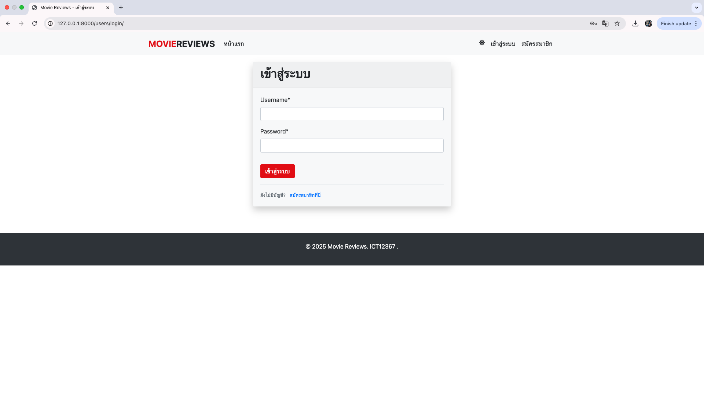
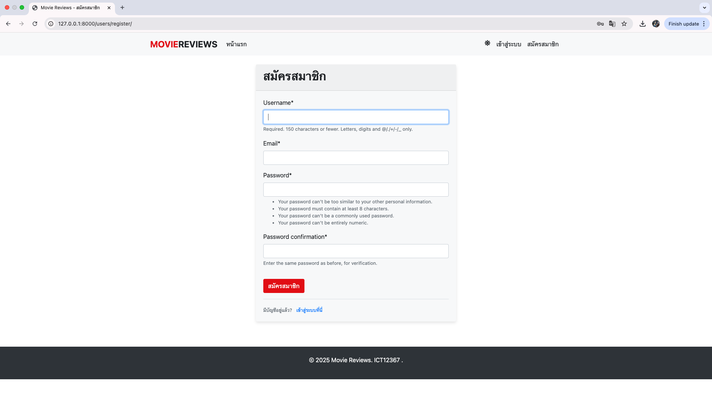
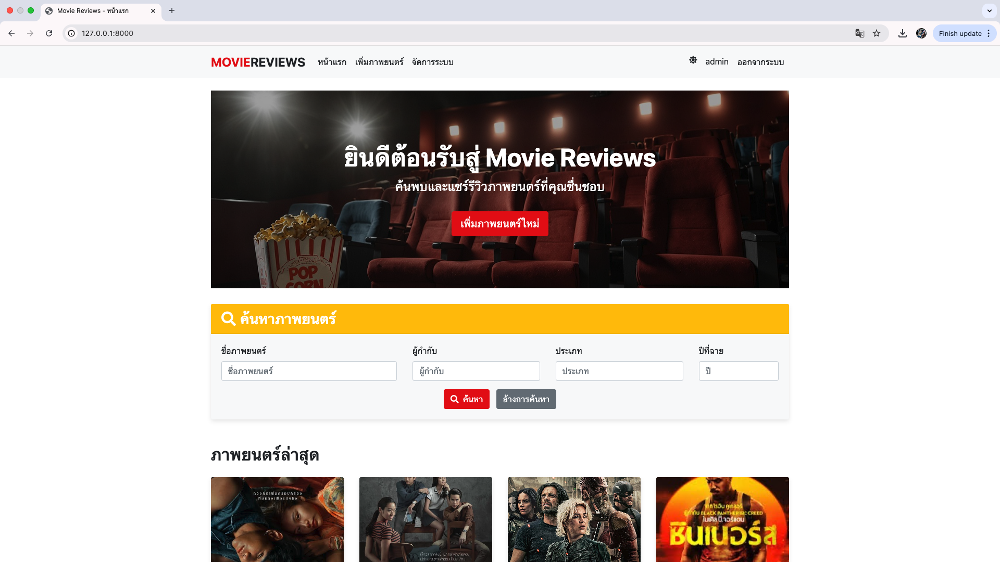
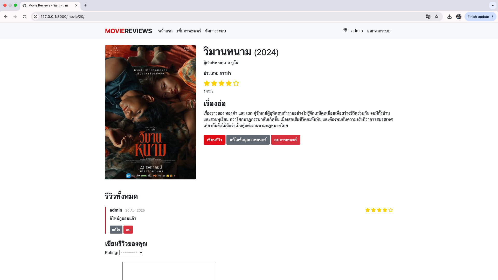
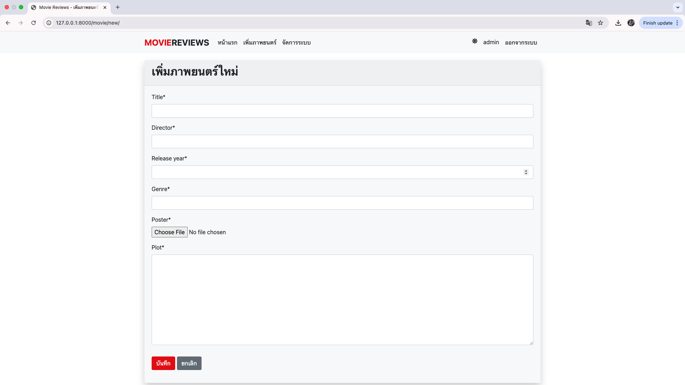
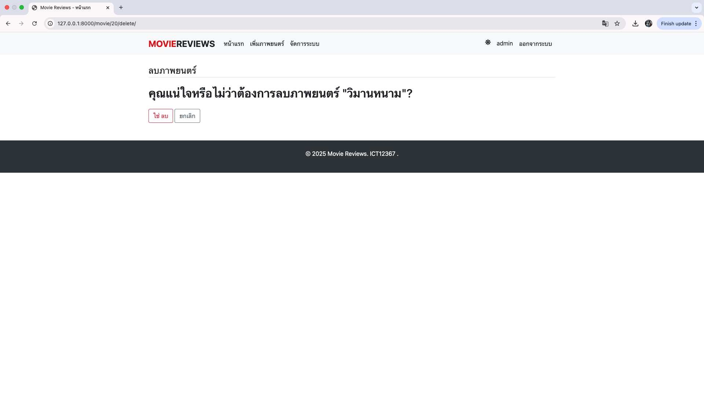
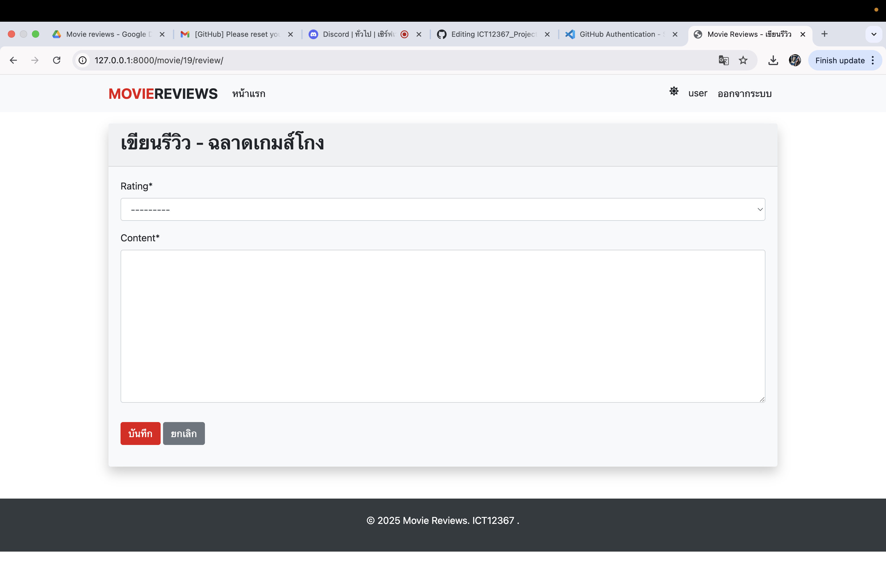

# ICT12367_movie_review_project 🎬 
### login

หน้าเข้าสู่ระบบ (Login Page)
- แบบฟอร์มเข้าสู่ระบบสำหรับผู้ใช้ที่มีบัญชีแล้ว
- ช่องกรอกชื่อผู้ใช้ (Username) และรหัสผ่าน (Password)
- ปุ่มเข้าสู่ระบบ

### Sign

หน้าสมัครสมาชิก (Signup Page)
- แบบฟอร์มสำหรับลงทะเบียนผู้ใช้งานใหม่
- ฟิลด์กรอกข้อมูล เช่น ชื่อผู้ใช้, รหัสผ่าน และอีเมล
- ปุ่มสมัครสมาชิก

### Home

หน้าแรก (Home Page)
- แสดงเมนูนำทางไปยังส่วนต่าง ๆ ของเว็บไซต์ เช่น “หน้าแรก”, “เพิ่มภาพยนตร์ ”
- แสดงภาพยนตร์ทั้งหมด
- มีช่องทางให้ค้นหาภาพยนตร์ เช่น “ชื่อภาพยนตร์”, “ประเภท”, “ปี”
- มีปุ่มสำหรับออกจากระบบ
  
### Movie Detail

หน้าแสดงรายละเอียดภาพยนตร์
- มีข้อมูลภาพยนตร์ เช่น รูปภาพ ประเภท เรื่องย่อ
- สามารถเพิ่ม แก้ไข หรือดูรีวิวทั้งหมดได้ และสามารถลบภาพยนตร์ได้

### Add Movie 

หน้าสำหรับเพิ่มภาพยนตร์ใหม่
- ฟิลด์กรอกข้อมูลเกี่ยวกับภาพยนตร์ที่ต้องการเพิ่ม เช่น ชื่อ, ผู้กำกับ, ประเภท , เรื่องย่อ

### Movie Delete

หน้าแสดงข้อความยืนยันการลบภาพยนตร์
- แสดงข้อความยืนยันการลบภาพยนตร์
- หลังลบภาพยนตร์จะมีข้อความยืนยัน "ลบภาพยนตร์แล้ว"

### Movie Review

หน้าสำหรับเพิ่มรีวิวใหม่
- มีตัวเลือกระดับความพึงพอใจ เช่น 4-ดี , 5-ดีมาก
- มีช่องสำหรับเพิ่มข้อความที่ต้องการรีวิว

---

## 🗂️ โครงสร้างหน้าหลักของระบบ

| ไฟล์ | หน้าที่ | คำอธิบาย |
|------|---------|-----------|
| `base.html` | Template แม่ | โครงสร้างหลักของทุกหน้า เช่น head/body |
| `home.html` | หน้าแรก | แสดงรายชื่อภาพยนตร์ทั้งหมด (เป็นลิงก์ไปยังหน้ารายละเอียด) |
| `movie_detail.html` | รายละเอียดภาพยนตร์ | เช่น ชื่อ, เรื่องย่อ และรีวิวทั้งหมดของภาพยนตร์ |
| `movie_form.html` | ฟอร์มภาพยนตร์ | สำหรับเพิ่มหรือแก้ไขข้อมูลภาพยนตร์ |
| `movie_confirm_delete.html` | ยืนยันลบ | ถามก่อนลบภาพยนตร์ (เพื่อความปลอดภัย) |
| `review_form.html` | ฟอร์มรีวิว | สำหรับเขียนรีวิวให้ภาพยนตร์แต่ละเรื่อง |

---

## 🔁 การทำงานของเว็บ

1. เข้า `home.html` เพื่อดูรายชื่อภาพยนตร์ทั้งหมด
2. คลิกชื่อภาพยนตร์ ➜ เข้า `movie_detail.html` เพื่อดูรายละเอียดและรีวิว
3. กด "เพิ่มรีวิว" เพื่อไปยัง `review_form.html`
4. เพิ่มหรือแก้ไขภาพยนตร์ผ่าน `movie_form.html`
5. ลบภาพยนตร์ผ่าน `movie_confirm_delete.html`
